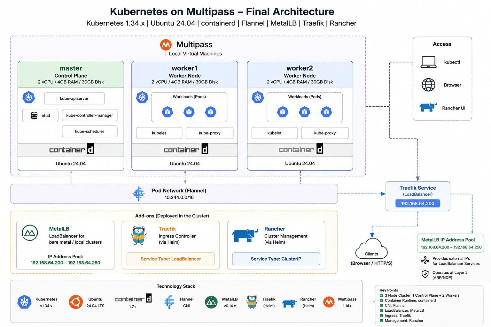

# Kubernetes on Multipass

Deploy a production-style multi-node Kubernetes cluster on your local machine using **Multipass**, **kubeadm**, and **containerd**.

This project creates a complete Kubernetes environment consisting of:

- 1 Control Plane node
- 2 Worker nodes
- Kubernetes v1.34.x
- Containerd runtime
- Flannel CNI
- MetalLB Load Balancer
- Traefik Ingress Controller
- Optional Rancher Management Platform

The entire cluster runs locally on Multipass virtual machines and is ideal for learning Kubernetes, testing workloads, CI/CD experiments, and local platform development.

---

## Features

- Kubernetes v1.34.x
- Ubuntu 24.04 LTS
- Containerd as container runtime
- Flannel networking
- MetalLB for LoadBalancer services
- Traefik Ingress Controller
- Rancher support
- Multi-node cluster (1 control plane + 2 workers)
- Automated node provisioning with Multipass
- Automatic worker node joining
- SSH connectivity between cluster nodes

---

## Table of Contents

- [Prerequisites](#prerequisites)
- [Quick Start](#quick-start)
- [Usage](#usage)
- [Optional](#Optional)
- [Cleanup](#cleanup)
- [Cluster Architecture](#cluster-architecture)

---

## Prerequisites

The following tools must be installed on your workstation.

### macOS

Install Multipass:

```bash
brew install --cask multipass
```

Install kubectl:

```bash
brew install kubectl
```

Install Helm:

```bash
brew install helm
```

Optional: Install mkcert for local TLS certificates:

```bash
brew install mkcert
mkcert --install
```

### Linux

Install:

- Multipass
- kubectl
- Helm

Useful links:

- https://multipass.run
- https://kubernetes.io/docs/tasks/tools/
- https://helm.sh/docs/intro/install/

---

## Quick Start

Clone the repository:

```bash
git clone https://github.com/<your-org>/kubeadm-with-multipass.git
cd kubeadm-with-multipass
```

Deploy the Kubernetes control plane:

```bash
./1-deploy-kubeadm-containerd-master.sh
```

Deploy the worker nodes:

```bash
./2-deploy-kubeadm-containerd-nodes.sh
```

Join worker nodes to the cluster:

```bash
./3-kubeadm_join_nodes.sh
```

Export kubeconfig:

```bash
export KUBECONFIG=$PWD/kubeconfig.yaml
```

Verify the cluster:

```bash
kubectl get nodes -o wide
```

Expected output:

```text
NAME      STATUS   ROLES           VERSION
master    Ready    control-plane   v1.34.x
worker1   Ready    node            v1.34.x
worker2   Ready    node            v1.34.x
```

---

## Usage

Export kubeconfig:

```bash
export KUBECONFIG=$PWD/kubeconfig.yaml
```

Check cluster status:

```bash
kubectl get nodes
kubectl get pods -A
kubectl get svc -A
```

Inspect node details:

```bash
kubectl describe node master
```

View workloads:

```bash
kubectl get deployments -A
kubectl get ingress -A
```

Common commands:

```bash
kubectl get nodes
kubectl get pods -A
kubectl get svc -A
kubectl get ingress -A
```

SSH into the control plane:

```bash
multipass shell master
```

SSH from master to workers:

```bash
ssh worker1
ssh worker2
```

---

## Optional

### Install MetalLB

MetalLB provides LoadBalancer functionality for local Kubernetes clusters.

Install:

```bash
./install-metal-lb.sh
```

Verify:

```bash
kubectl get pods -n metallb-system
```

Check services:

```bash
kubectl get svc -A
```

Services of type `LoadBalancer` should receive an external IP address.

---

### Install Traefik

Install Traefik Ingress Controller:

```bash
./install-traefik.sh
```

Verify:

```bash
kubectl get pods -n traefik
kubectl get svc -n traefik
```

Expected:

```text
NAME      TYPE           EXTERNAL-IP
traefik   LoadBalancer   192.168.x.x
```

---

### Install Rancher

Install Rancher on top of the Kubernetes cluster:

```bash
./4-deploy-rancher-on-kubeadm.sh
```

Verify:

```bash
kubectl get pods -n cattle-system
```

Retrieve the bootstrap password:

```bash
kubectl get secret \
  --namespace cattle-system \
  bootstrap-secret \
  -o go-template='{{.data.bootstrapPassword|base64decode}}{{ "\n" }}'
```

Port-forward Rancher:

```bash
kubectl -n cattle-system port-forward deploy/rancher 4443:443
```

Open:

```text
https://127.0.0.1:4443
```

---

## Troubleshooting

List Multipass instances:

```bash
multipass list
```

Show VM details:

```bash
multipass info master
```

Check cluster health:

```bash
kubectl get nodes
kubectl get pods -A
```

Check kubelet logs:

```bash
sudo journalctl -u kubelet -f
```

Check containerd:

```bash
sudo systemctl status containerd
```

---

## Cleanup

Delete all Multipass instances:

```bash
multipass delete --all
multipass purge
```

Remove local kubeconfig:

```bash
rm -f kubeconfig.yaml
```

---

## cluster-architecture

